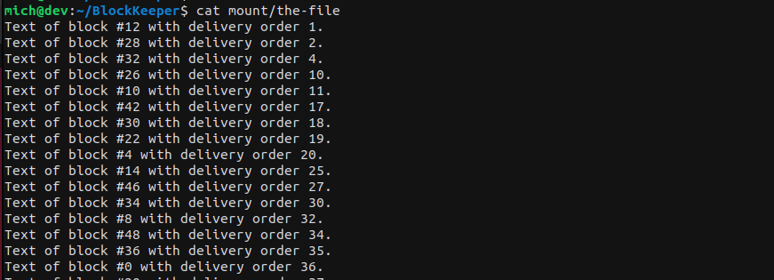
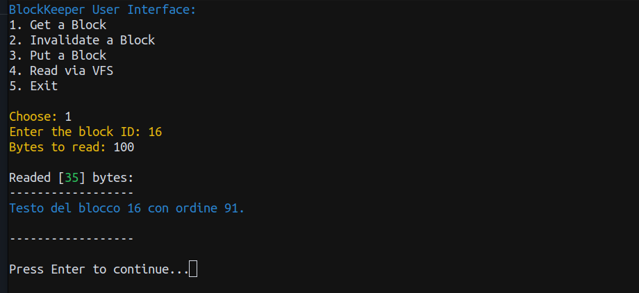
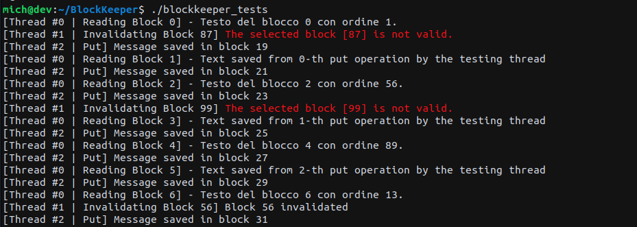

# BlockKeeper
This repository contains the source code for the **Blockkeeper** module, which is a Linux kernel module that provides functionality for managing a block-based file system of user messages and hosted in a single file. The module allows users to save messages, read the message saved in a certain block and invalidate blocks and their contents.

The device driver is based on system calls partially supported by the VFS and partially not. The provided VFS non-supported system calls are as follows:
```C
  int put_data(char *source, size_t size)
```
* This system call is used to put `size` bytes of user-space data identified by the `source` pointer into a **free block** of the block device. The operation is executed all or nothing and if there is no space available on the device, it will return the `ENOMEM` error.

```C
int get_data(int offset, char *destination, size_t size)
```
* This system call is used to read up to `size` bytes from the block at a given `offset`, if it currently keeps data. The system call return the *amount of bytes* actually loaded into the destination area or zero if no data is currently kept by the device block. If no data is currently valid and associated with the offset parameter, it returns the `ENODATA` error.

```C
int invalidate_data(int offset)
```
* This system call is used to invalidate (logically) data in a block at a given `offset`. It returns the `ENODATA` error if the block is not valid.

## Installation
To install the Blockkeeper module, follow these steps:

1. Ensure that you have the necessary kernel headers installed for your current kernel version (tested with kernel headers version **6.2.0-25-generic**).
2. Clone this repository to your local machine and change into the cloned directory.
3. Install the Sytem-Call Table discovery module

```bash
cd SYS_CALL_TABLE_DISCOVER
make all
./load.sh
```
4. Build the Blockkeeper module by running the following command:

```bash
cd ..
make build
```
5. Format the device for the file system

```bash
make make-fs
```

6. Install the module and mount the formatted device

```bash
make install
```

### Configuration
Before the installation phase, some parameters can be configured at compile-time by editing the Makefile:
* `NBLOCKS`: the **maximum number** of manageable blocks. 
  * The default device driver configuration can handle 102 blocks, of which 100 of them can contain up to 4085bytes of user data, while the remaining 2 blocks contain metadata for device driver management.
  * Therefore, if you want to change this parameter, you have to take into account the two blocks of metadata.
* `WB_DAEMON`: if this parameters is equals to 0 the operation of reporting data on the device, after a `put`/`invalidate` has been executed, will be done immediately ina synchronous manner. Otherwise, it will be run by the page-cache write back deamon of the Linux Kernel.

Example of custom configuration:
```bash
make build NBLOCKS=52 WB_DEAMON=0
```
> Make sure to compile the user interface and tests with the same NBLOCKS parameter.

## Usage
This repository also provide:
* `blockkeeper_cli`: A command-line utility for interacting with the blockkeeper module.
* `blockkeeper_tests`: A test suite for validating the functionality of the blockkeeper module.

These artifacts can be builded with the following commands:
```bash
make user
make test
```

#### VFS Read operation
The device driver supports the file system `read()` operation which returns to the user the contents of the blocks ordered according to how they were saved on the device, from oldest to most recent.

Example:


#### User CLI
The primary utility for interacting with the blockkeeper module is the blockkeeper_cli command-line tool. To use it, run the following command:

```bash
./blockkeeper_cli
```
This will start the interactive shell for the blockkeeper command-line interface. From there, you can use various commands to manage blocks within the block-based file system.


#### Test
To run the test suite for the blockkeeper module, execute the following command:

The tests validate the functionality of the operations that the module offers, in particular writes, reads and invalidations are performed by three different threads in order to highlight the correct implementation of the operations in concurrency scenarios.
## Uninstallation
To uninstall the blockkeeper module and unmount the file system, use the following command:
```bash
make uninstall
```

To clean the project and remove any build artifacts, run the following command:
```bash
make clean
```

## Author
The Blockkeeper module is developed by [Michele Salvatori](www.github.com/michsalvv).

